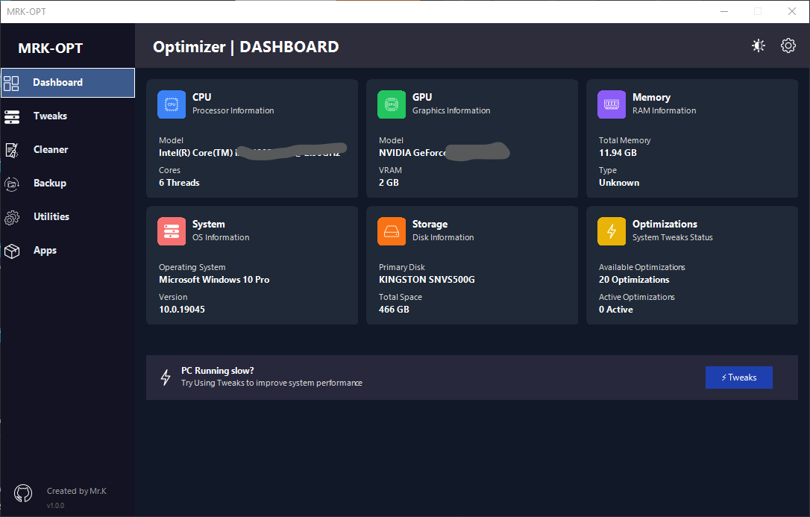

# 🛠️ WinUtil - Windows Maintenance & Utility Toolkit (v2.0)



**WinUtil v2.0** is a comprehensive PowerShell-based utility that automates Windows maintenance, optimization, and customization tasks. Designed for both technical users and beginners, it provides a streamlined way to keep your system clean, fast, and secure.

> 📜 **Previous Version**: [WinUtil v1.0](https://github.com/Mrkweb15/mrkwebWinutil) (Legacy version)
> 
---

## 🚀 What's New in Version 2.0
- **Completely rewritten codebase** for better performance and reliability
- **Enhanced UI/UX** with improved progress tracking and visual feedback
- **New module system** allowing for easier feature expansion
- **Improved error handling** and logging capabilities
- **Expanded software library** with more popular applications
- **Additional privacy controls** and Windows 11-specific optimizations

---

## ⚙️ Core Features

### 🧹 System Maintenance
- Deep clean temporary files, logs, and cache locations
- Clear Recycle Bin and file history
- Remove Windows Update cache and error reports
- Disk cleanup and optimization

### 🛠️ Repair Tools
- Automated SFC / DISM system file repair
- Windows Update troubleshooting
- Network reset (TCP/IP, DNS, Winsock)
- Driver verification and repair

### ⚡ Performance Tweaks
- Disable background apps and telemetry
- Optimize startup programs and services
- Adjust visual effects for performance
- SSD optimization tweaks

### 🔒 Privacy & Security
- Disable tracking and data collection
- Block telemetry servers via HOSTS file
- Remove Cortana, OneDrive (optional)
- Configure Windows Defender settings

### 📦 Software Management
- One-click install for popular apps:
  - Browsers (Chrome, Firefox, Edge)
  - Utilities (7-Zip, WinRAR, Notepad++)
  - Dev tools (VS Code, Git, Python)
  - Media players (VLC, Spotify)

### 🎛️ Windows Customization
- Context menu tweaks
- Explorer UI adjustments
- Taskbar and Start menu customization
- Dark mode and accent color controls

---

## 📥 Installation & Usage

### ✅ Requirements
- Windows 10/11 (64-bit recommended)
- Administrator privileges
- PowerShell 5.1+ (included in Windows 10/11)
- Internet connection (for some features)

### ⚡ Quick Start
Run this command in PowerShell (Admin):

```powershell
irm tinyurl.com/Mrk-WinUtil-V2 | iex
